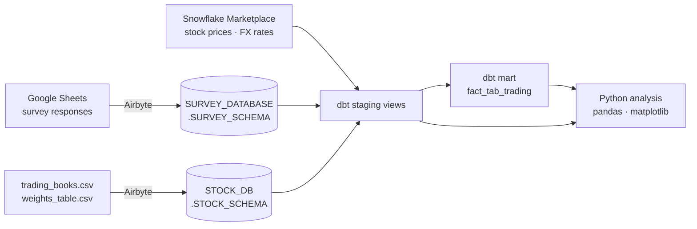

# Multi-Source ELT Pipeline: Airbyte → Snowflake → dbt

An ELT pipeline that brings three sources into Snowflake: a Google Sheets survey, trading-desk CSV files, and Snowflake Marketplace stock and FX time series. dbt then models them into staging views and a trade-level profit fact table, and the results are analyzed in Python.

## Architecture



## dbt models

| Model | Type | Purpose |
| --- | --- | --- |
| `transform_survey` | view | Renames long survey-question columns to short snake_case fields |
| `staging_valid_stock_tickers` | view | Distinct ticker/date pairs from Equity Desk trades |
| `staging_valid_fx_tickers` | view | Distinct ticker/date pairs from FX Desk trades |
| `staging_valid_stock_info` | view | Joins equity trades to Marketplace daily highs and lows |
| `staging_valid_fx_info` | view | Joins FX trade dates to EUR/USD and GBP/USD rates |
| `staging_buy_sell_joint` | view | Pairs each buy with its sell by trader and trade date |
| `fact_tab_trading` | table | Trade-level `BUY_MONEY`, `SELL_MONEY`, and `PROFIT` |

Sources are declared in [`dbt_pipeline/models/schema.yml`](dbt_pipeline/models/schema.yml).

## Results

| Desk | Total profit | Profit rate |
| --- | ---: | ---: |
| FX Desk | 5,000.00 | 0.63% |
| Equity Desk | 2,718.75 | 1.27% |

The FX desk earns more in absolute terms, but the Equity desk turns its capital over at twice the rate. The notebook also profiles the survey data (standing, preferred LLM, VR-headset ownership vs. LLM preference, and so on) with SQL `GROUP BY`, window-function ranking, and matplotlib charts.

## Tech stack

Snowflake · Airbyte Cloud · dbt (dbt-snowflake, dbt-utils) · Python · snowflake-connector-python · pandas · matplotlib

## Project structure

```text
Snowflake-dbt-ELT-Pipeline/
├── elt_pipeline_analysis.ipynb     # setup walkthrough, validation queries, analysis
├── dbt_pipeline/
│   ├── dbt_project.yml
│   ├── packages.yml
│   ├── profiles.example.yml        # copy to ~/.dbt/profiles.yml
│   └── models/
│       ├── schema.yml              # source declarations
│       ├── staging/                # staging views
│       └── marts/                  # fact table
└── requirements.txt
```

## Running locally

```bash
pip install -r requirements.txt

export SNOWFLAKE_ACCOUNT=<account_identifier>
export SNOWFLAKE_USER=<user>
export SNOWFLAKE_PASSWORD=<password>

cp dbt_pipeline/profiles.example.yml ~/.dbt/profiles.yml
cd dbt_pipeline
dbt deps
dbt debug
dbt run                     # survey models (target: dev)
dbt run --target stock_db   # trading models
```

The Snowflake setup SQL (warehouse, databases, role, grants, schemas) is in the notebook's setup section. Airbyte connections are configured in the Airbyte Cloud UI.

> **Privacy:** the survey table contains respondent emails, so the notebook's row-level survey outputs are cleared and no raw survey data is committed.

---

*Date finished: April 18, 2026*
